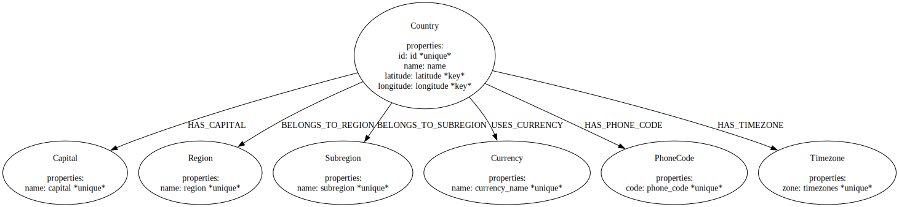
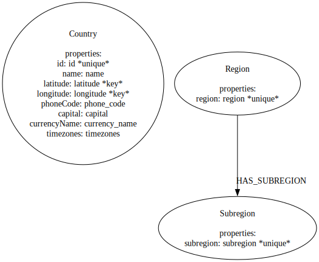

```python
import pandas as pd
from neo4j_runway import Discovery, LLM, GraphDataModeler, IngestionGenerator, PyIngest
from dotenv import load_dotenv

load_dotenv()
```


    True


```python
USER_GENERATED_INPUT = {
    'general_description': 'This is data on different countries.',
    'id': 'unique id for a country.',
    'name': 'the country name.',
    'phone_code': 'country area code.',
    'capital': 'the capital of the country.',
    'currency_name': "name of the country's currency.",
    'region': 'primary region of the country.',
    'subregion': 'subregion location of the country.',
    'timezones': 'timezones contained within the country borders.',
    'latitude': 'the latitude coordinate of the country center. should be part of node key.',
    'longitude': 'the longitude coordinate of the country center. should be part of node key.'
}
data = pd.read_csv("data/countries.csv")
data.head()
```


<div>
<style scoped>
    .dataframe tbody tr th:only-of-type {
        vertical-align: middle;
    }

    .dataframe tbody tr th {
        vertical-align: top;
    }

    .dataframe thead th {
        text-align: right;
    }
</style>
<table border="1" class="dataframe">
  <thead>
    <tr style="text-align: right;">
      <th></th>
      <th>id</th>
      <th>name</th>
      <th>iso3</th>
      <th>iso2</th>
      <th>numeric_code</th>
      <th>phone_code</th>
      <th>capital</th>
      <th>currency</th>
      <th>currency_name</th>
      <th>currency_symbol</th>
      <th>tld</th>
      <th>native</th>
      <th>region</th>
      <th>subregion</th>
      <th>timezones</th>
      <th>latitude</th>
      <th>longitude</th>
      <th>emoji</th>
      <th>emojiU</th>
    </tr>
  </thead>
  <tbody>
    <tr>
      <th>0</th>
      <td>1</td>
      <td>Afghanistan</td>
      <td>AFG</td>
      <td>AF</td>
      <td>4</td>
      <td>93</td>
      <td>Kabul</td>
      <td>AFN</td>
      <td>Afghan afghani</td>
      <td>؋</td>
      <td>.af</td>
      <td>افغانستان</td>
      <td>Asia</td>
      <td>Southern Asia</td>
      <td>[{zoneName:'Asia\/Kabul',gmtOffset:16200,gmtOf...</td>
      <td>33.000000</td>
      <td>65.0</td>
      <td>🇦🇫</td>
      <td>U+1F1E6 U+1F1EB</td>
    </tr>
    <tr>
      <th>1</th>
      <td>2</td>
      <td>Aland Islands</td>
      <td>ALA</td>
      <td>AX</td>
      <td>248</td>
      <td>+358-18</td>
      <td>Mariehamn</td>
      <td>EUR</td>
      <td>Euro</td>
      <td>€</td>
      <td>.ax</td>
      <td>Åland</td>
      <td>Europe</td>
      <td>Northern Europe</td>
      <td>[{zoneName:'Europe\/Mariehamn',gmtOffset:7200,...</td>
      <td>60.116667</td>
      <td>19.9</td>
      <td>🇦🇽</td>
      <td>U+1F1E6 U+1F1FD</td>
    </tr>
    <tr>
      <th>2</th>
      <td>3</td>
      <td>Albania</td>
      <td>ALB</td>
      <td>AL</td>
      <td>8</td>
      <td>355</td>
      <td>Tirana</td>
      <td>ALL</td>
      <td>Albanian lek</td>
      <td>Lek</td>
      <td>.al</td>
      <td>Shqipëria</td>
      <td>Europe</td>
      <td>Southern Europe</td>
      <td>[{zoneName:'Europe\/Tirane',gmtOffset:3600,gmt...</td>
      <td>41.000000</td>
      <td>20.0</td>
      <td>🇦🇱</td>
      <td>U+1F1E6 U+1F1F1</td>
    </tr>
    <tr>
      <th>3</th>
      <td>4</td>
      <td>Algeria</td>
      <td>DZA</td>
      <td>DZ</td>
      <td>12</td>
      <td>213</td>
      <td>Algiers</td>
      <td>DZD</td>
      <td>Algerian dinar</td>
      <td>دج</td>
      <td>.dz</td>
      <td>الجزائر</td>
      <td>Africa</td>
      <td>Northern Africa</td>
      <td>[{zoneName:'Africa\/Algiers',gmtOffset:3600,gm...</td>
      <td>28.000000</td>
      <td>3.0</td>
      <td>🇩🇿</td>
      <td>U+1F1E9 U+1F1FF</td>
    </tr>
    <tr>
      <th>4</th>
      <td>5</td>
      <td>American Samoa</td>
      <td>ASM</td>
      <td>AS</td>
      <td>16</td>
      <td>+1-684</td>
      <td>Pago Pago</td>
      <td>USD</td>
      <td>US Dollar</td>
      <td>$</td>
      <td>.as</td>
      <td>American Samoa</td>
      <td>Oceania</td>
      <td>Polynesia</td>
      <td>[{zoneName:'Pacific\/Pago_Pago',gmtOffset:-396...</td>
      <td>-14.333333</td>
      <td>-170.0</td>
      <td>🇦🇸</td>
      <td>U+1F1E6 U+1F1F8</td>
    </tr>
  </tbody>
</table>
</div>


```python
llm = LLM()
```


```python
disc = Discovery(llm=llm, user_input=USER_GENERATED_INPUT, data=data)
```


```python
disc.run(show_result=True, notebook=True)
```


Based on the provided summary and description of the data, here is a preliminary analysis:

### Overall Details:
1. **Data Completeness**:
   - The dataset contains 250 entries (countries).
   - Most columns are complete, but there are some missing values in the `capital`, `region`, and `subregion` columns.
     - `capital`: 245 non-null (5 missing)
     - `region`: 248 non-null (2 missing)
     - `subregion`: 247 non-null (3 missing)

2. **Data Types**:
   - The dataset includes a mix of data types:
     - Numerical: `id`, `latitude`, `longitude`
     - Categorical: `name`, `phone_code`, `capital`, `currency_name`, `region`, `subregion`, `timezones`

3. **Unique Values**:
   - `name` (country name) is unique for each entry.
   - `phone_code` has 235 unique values, indicating some countries share the same phone code.
   - `capital` has 244 unique values, with one capital (`Kingston`) appearing twice.
   - `currency_name` has 161 unique values, with `Euro` being the most common (35 occurrences).
   - `region` has 6 unique values, with `Africa` being the most frequent (60 occurrences).
   - `subregion` has 22 unique values, with `Caribbean` being the most frequent (28 occurrences).
   - `timezones` has 245 unique values, with one timezone appearing three times.

### Important Features:
1. **Geographical Coordinates (`latitude` and `longitude`)**:
   - These are crucial for spatial analysis and can be used to visualize the countries on a map.
   - They have a wide range, covering the entire globe.

2. **Country Name (`name`)**:
   - This is a unique identifier for each country and is essential for any country-specific analysis.

3. **Phone Code (`phone_code`)**:
   - This can be useful for telecommunications analysis and understanding regional dialing patterns.

4. **Capital (`capital`)**:
   - Knowing the capital city is important for geopolitical and economic studies.

5. **Currency Name (`currency_name`)**:
   - This is vital for economic and financial analysis, especially in understanding trade and monetary policies.

6. **Region and Subregion (`region` and `subregion`)**:
   - These features are important for regional analysis and understanding geopolitical groupings.

7. **Timezones (`timezones`)**:
   - This is important for understanding time-related aspects, such as business hours, communication, and travel.

### Summary:
- The dataset is relatively complete with a few missing values in `capital`, `region`, and `subregion`.
- The data includes a mix of numerical and categorical features, with unique identifiers for each country.
- Key features for analysis include geographical coordinates, country name, phone code, capital, currency name, region, subregion, and timezones.
- The dataset provides a comprehensive overview of countries, which can be used for various types of analysis, including geographical, economic, and geopolitical studies.

This preliminary analysis sets the stage for further exploration and potential modeling, including the creation of a graph data model.


```python
# disc.view_discovery(notebook=False)
```


```python
# disc.to_txt()
# disc.to_markdown()
```


```python
gdm = GraphDataModeler(llm=llm, discovery=disc)
```


```python
gdm.create_initial_model()
```

    recieved a valid response


    DataModel(nodes=[Node(label='Country', properties=[Property(name='id', type='int', csv_mapping='id', csv_mapping_other=None, is_unique=True, part_of_key=False), Property(name='name', type='str', csv_mapping='name', csv_mapping_other=None, is_unique=False, part_of_key=False), Property(name='latitude', type='float', csv_mapping='latitude', csv_mapping_other=None, is_unique=False, part_of_key=True), Property(name='longitude', type='float', csv_mapping='longitude', csv_mapping_other=None, is_unique=False, part_of_key=True)], csv_name=''), Node(label='Capital', properties=[Property(name='name', type='str', csv_mapping='capital', csv_mapping_other=None, is_unique=True, part_of_key=False)], csv_name=''), Node(label='Region', properties=[Property(name='name', type='str', csv_mapping='region', csv_mapping_other=None, is_unique=True, part_of_key=False)], csv_name=''), Node(label='Subregion', properties=[Property(name='name', type='str', csv_mapping='subregion', csv_mapping_other=None, is_unique=True, part_of_key=False)], csv_name=''), Node(label='Currency', properties=[Property(name='name', type='str', csv_mapping='currency_name', csv_mapping_other=None, is_unique=True, part_of_key=False)], csv_name=''), Node(label='PhoneCode', properties=[Property(name='code', type='str', csv_mapping='phone_code', csv_mapping_other=None, is_unique=True, part_of_key=False)], csv_name=''), Node(label='Timezone', properties=[Property(name='zone', type='str', csv_mapping='timezones', csv_mapping_other=None, is_unique=True, part_of_key=False)], csv_name='')], relationships=[Relationship(type='HAS_CAPITAL', properties=[], source='Country', target='Capital', csv_name=''), Relationship(type='BELONGS_TO_REGION', properties=[], source='Country', target='Region', csv_name=''), Relationship(type='BELONGS_TO_SUBREGION', properties=[], source='Country', target='Subregion', csv_name=''), Relationship(type='USES_CURRENCY', properties=[], source='Country', target='Currency', csv_name=''), Relationship(type='HAS_PHONE_CODE', properties=[], source='Country', target='PhoneCode', csv_name=''), Relationship(type='HAS_TIMEZONE', properties=[], source='Country', target='Timezone', csv_name='')])


```python
gdm.current_model.visualize()
```


    

    


```python
gdm.iterate_model(user_corrections="""
Make Region node have a HAS_SUBREGION relationship with Subregion node. 
Remove The relationship between Country and Region.
""")
```

    recieved a valid response


    DataModel(nodes=[Node(label='Country', properties=[Property(name='id', type='int', csv_mapping='id', csv_mapping_other=None, is_unique=True, part_of_key=False), Property(name='name', type='str', csv_mapping='name', csv_mapping_other=None, is_unique=False, part_of_key=False), Property(name='latitude', type='float', csv_mapping='latitude', csv_mapping_other=None, is_unique=False, part_of_key=True), Property(name='longitude', type='float', csv_mapping='longitude', csv_mapping_other=None, is_unique=False, part_of_key=True), Property(name='phoneCode', type='str', csv_mapping='phone_code', csv_mapping_other=None, is_unique=False, part_of_key=False), Property(name='capital', type='str', csv_mapping='capital', csv_mapping_other=None, is_unique=False, part_of_key=False), Property(name='currencyName', type='str', csv_mapping='currency_name', csv_mapping_other=None, is_unique=False, part_of_key=False), Property(name='timezones', type='str', csv_mapping='timezones', csv_mapping_other=None, is_unique=False, part_of_key=False)], csv_name='countries.csv'), Node(label='Region', properties=[Property(name='region', type='str', csv_mapping='region', csv_mapping_other=None, is_unique=True, part_of_key=False)], csv_name='regions.csv'), Node(label='Subregion', properties=[Property(name='subregion', type='str', csv_mapping='subregion', csv_mapping_other=None, is_unique=True, part_of_key=False)], csv_name='subregions.csv')], relationships=[Relationship(type='HAS_SUBREGION', properties=[], source='Region', target='Subregion', csv_name='regions_subregions.csv')])


```python
gdm.current_model.visualize()
```


    

    


```python
gen = IngestionGenerator(data_model=gdm.current_model, csv_name="countries.csv")
```


```python
gdm.current_model.to_arrows()
```


    ArrowsDataModel(nodes=[ArrowsNode(id='Country', position={'x': 0.0, 'y': 0.0}, caption='', labels=['Country'], properties={'id': 'id | int | unique', 'name': 'name | str', 'latitude': 'latitude | float | nodekey', 'longitude': 'longitude | float | nodekey'}, style={}), ArrowsNode(id='PhoneCode', position={'x': 200.0, 'y': 0.0}, caption='', labels=['PhoneCode'], properties={'code': 'phone_code | str | unique'}, style={}), ArrowsNode(id='Capital', position={'x': 400.0, 'y': 0.0}, caption='', labels=['Capital'], properties={'name': 'capital | str | unique'}, style={}), ArrowsNode(id='Currency', position={'x': 600.0, 'y': 0.0}, caption='', labels=['Currency'], properties={'name': 'currency_name | str | unique'}, style={}), ArrowsNode(id='Region', position={'x': 800.0, 'y': -200.0}, caption='', labels=['Region'], properties={'name': 'region | str | unique'}, style={}), ArrowsNode(id='Subregion', position={'x': 0.0, 'y': -200.0}, caption='', labels=['Subregion'], properties={'name': 'subregion | str | unique'}, style={}), ArrowsNode(id='Timezone', position={'x': 200.0, 'y': -200.0}, caption='', labels=['Timezone'], properties={'zone': 'timezones | str | unique'}, style={})], relationships=[ArrowsRelationship(id='HAS_PHONE_CODECountryPhoneCode', fromId='Country', toId='PhoneCode', type='HAS_PHONE_CODE', properties={}, style={}), ArrowsRelationship(id='HAS_CAPITALCountryCapital', fromId='Country', toId='Capital', type='HAS_CAPITAL', properties={}, style={}), ArrowsRelationship(id='USES_CURRENCYCountryCurrency', fromId='Country', toId='Currency', type='USES_CURRENCY', properties={}, style={}), ArrowsRelationship(id='BELONGS_TO_SUBREGIONCountrySubregion', fromId='Country', toId='Subregion', type='BELONGS_TO_SUBREGION', properties={}, style={}), ArrowsRelationship(id='HAS_TIMEZONECountryTimezone', fromId='Country', toId='Timezone', type='HAS_TIMEZONE', properties={}, style={}), ArrowsRelationship(id='HAS_SUBREGIONRegionSubregion', fromId='Region', toId='Subregion', type='HAS_SUBREGION', properties={}, style={})], style={'font-family': 'Nunito Sans', 'background-color': '#F2F2F2', 'background-image': '', 'background-size': '100%', 'node-color': '#4C8EDA', 'border-width': 0, 'border-color': '#000000', 'radius': 75, 'node-padding': 5, 'node-margin': 2, 'outside-position': 'auto', 'node-icon-image': '', 'node-background-image': '', 'icon-position': 'inside', 'icon-size': 64, 'caption-position': 'inside', 'caption-max-width': 200, 'caption-color': '#ffffff', 'caption-font-size': 20, 'caption-font-weight': 'normal', 'label-position': 'inside', 'label-display': 'bare', 'label-color': '#ffffff', 'label-background-color': '#848484', 'label-border-color': '#848484', 'label-border-width': 3, 'label-font-size': 20, 'label-padding': 5, 'label-margin': 4, 'directionality': 'directed', 'detail-position': 'above', 'detail-orientation': 'parallel', 'arrow-width': 3, 'arrow-color': '#848484', 'margin-start': 5, 'margin-end': 5, 'margin-peer': 20, 'attachment-start': 'normal', 'attachment-end': 'normal', 'relationship-icon-image': '', 'type-color': '#848484', 'type-background-color': '#F2F2F2', 'type-border-color': '#848484', 'type-border-width': 0, 'type-font-size': 21, 'type-padding': 5, 'property-position': 'outside', 'property-alignment': 'colon', 'property-color': '#848484', 'property-font-size': 20, 'property-font-weight': 'normal'})


```python
print(gen.generate_load_csv_string())
```

    CREATE CONSTRAINT country_id IF NOT EXISTS FOR (n:Country) REQUIRE n.id IS UNIQUE;
    CREATE CONSTRAINT country_latitude_longitude IF NOT EXISTS FOR (n:Country) REQUIRE (n.latitude, n.longitude) IS NODE KEY;
    CREATE CONSTRAINT phonecode_code IF NOT EXISTS FOR (n:PhoneCode) REQUIRE n.code IS UNIQUE;
    CREATE CONSTRAINT capital_name IF NOT EXISTS FOR (n:Capital) REQUIRE n.name IS UNIQUE;
    CREATE CONSTRAINT currency_name IF NOT EXISTS FOR (n:Currency) REQUIRE n.name IS UNIQUE;
    CREATE CONSTRAINT region_name IF NOT EXISTS FOR (n:Region) REQUIRE n.name IS UNIQUE;
    CREATE CONSTRAINT subregion_name IF NOT EXISTS FOR (n:Subregion) REQUIRE n.name IS UNIQUE;
    CREATE CONSTRAINT timezone_zone IF NOT EXISTS FOR (n:Timezone) REQUIRE n.zone IS UNIQUE;
    LOAD CSV WITH HEADERS FROM 'file:///countries.csv' as row
    CALL {
        WITH row
        MERGE (n:Country {latitude: row.latitude, longitude: row.longitude})
        SET n.name = row.name
    } IN TRANSACTIONS OF 100 ROWS;
    LOAD CSV WITH HEADERS FROM 'file:///countries.csv' as row
    CALL {
        WITH row
        MERGE (n:PhoneCode {code: row.phone_code})
        
    } IN TRANSACTIONS OF 100 ROWS;
    LOAD CSV WITH HEADERS FROM 'file:///countries.csv' as row
    CALL {
        WITH row
        MERGE (n:Capital {name: row.capital})
        
    } IN TRANSACTIONS OF 100 ROWS;
    LOAD CSV WITH HEADERS FROM 'file:///countries.csv' as row
    CALL {
        WITH row
        MERGE (n:Currency {name: row.currency_name})
        
    } IN TRANSACTIONS OF 100 ROWS;
    LOAD CSV WITH HEADERS FROM 'file:///countries.csv' as row
    CALL {
        WITH row
        MERGE (n:Region {name: row.region})
        
    } IN TRANSACTIONS OF 100 ROWS;
    LOAD CSV WITH HEADERS FROM 'file:///countries.csv' as row
    CALL {
        WITH row
        MERGE (n:Subregion {name: row.subregion})
        
    } IN TRANSACTIONS OF 100 ROWS;
    LOAD CSV WITH HEADERS FROM 'file:///countries.csv' as row
    CALL {
        WITH row
        MERGE (n:Timezone {zone: row.timezones})
        
    } IN TRANSACTIONS OF 100 ROWS;
    LOAD CSV WITH HEADERS FROM 'file:///countries.csv' as row
    CALL {
        WITH row
        MATCH (source:Country {latitude: row.latitude, longitude: row.longitude})
        MATCH (target:PhoneCode {code: row.phone_code})
        MERGE (source)-[n:HAS_PHONE_CODE]->(target)
        
    } IN TRANSACTIONS OF 100 ROWS;
    LOAD CSV WITH HEADERS FROM 'file:///countries.csv' as row
    CALL {
        WITH row
        MATCH (source:Country {latitude: row.latitude, longitude: row.longitude})
        MATCH (target:Capital {name: row.capital})
        MERGE (source)-[n:HAS_CAPITAL]->(target)
        
    } IN TRANSACTIONS OF 100 ROWS;
    LOAD CSV WITH HEADERS FROM 'file:///countries.csv' as row
    CALL {
        WITH row
        MATCH (source:Country {latitude: row.latitude, longitude: row.longitude})
        MATCH (target:Currency {name: row.currency_name})
        MERGE (source)-[n:USES_CURRENCY]->(target)
        
    } IN TRANSACTIONS OF 100 ROWS;
    LOAD CSV WITH HEADERS FROM 'file:///countries.csv' as row
    CALL {
        WITH row
        MATCH (source:Country {latitude: row.latitude, longitude: row.longitude})
        MATCH (target:Subregion {name: row.subregion})
        MERGE (source)-[n:BELONGS_TO_SUBREGION]->(target)
        
    } IN TRANSACTIONS OF 100 ROWS;
    LOAD CSV WITH HEADERS FROM 'file:///countries.csv' as row
    CALL {
        WITH row
        MATCH (source:Country {latitude: row.latitude, longitude: row.longitude})
        MATCH (target:Timezone {zone: row.timezones})
        MERGE (source)-[n:HAS_TIMEZONE]->(target)
        
    } IN TRANSACTIONS OF 100 ROWS;
    LOAD CSV WITH HEADERS FROM 'file:///countries.csv' as row
    CALL {
        WITH row
        MATCH (source:Region {name: row.region})
        MATCH (target:Subregion {name: row.subregion})
        MERGE (source)-[n:HAS_SUBREGION]->(target)
        
    } IN TRANSACTIONS OF 100 ROWS;
    


```python

```
